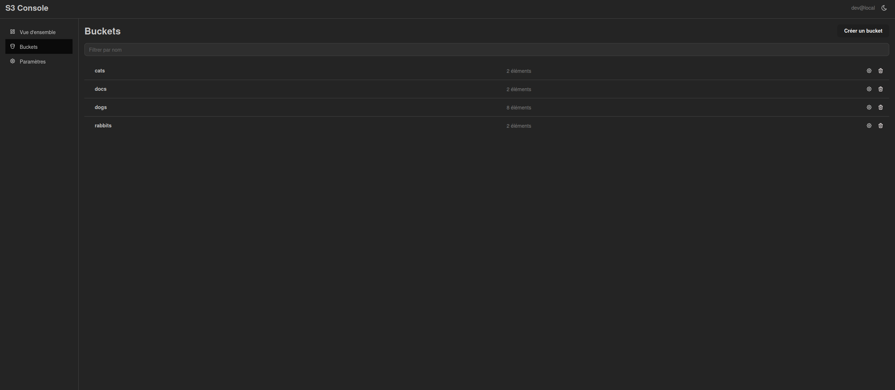
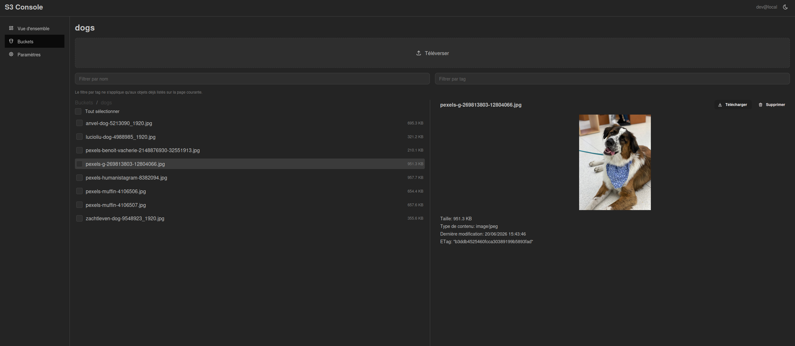
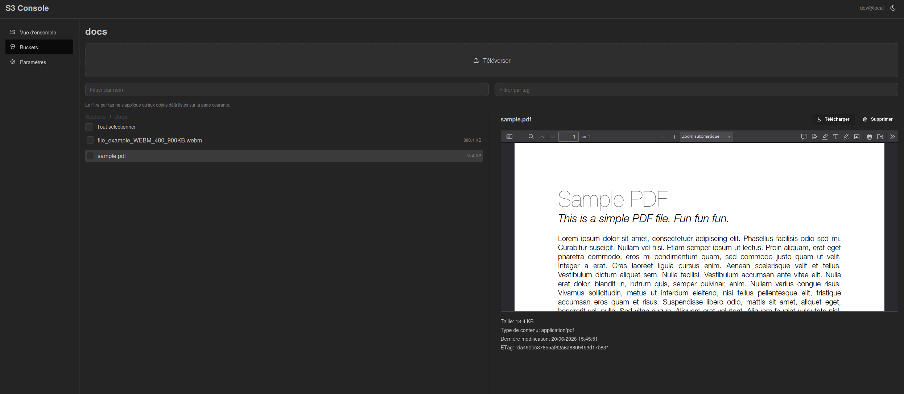

# S3 Console

[](./LICENSE)
[](https://github.com/computingsquare/s3-console/actions/workflows/ci.yml)
[](https://github.com/computingsquare/s3-console/pkgs/container/s3-console)

A self-hosted web console for S3-compatible object storage: bucket and object
browsing, upload/download, multi-select, per-bucket policy/CORS/lifecycle
configuration, role-based access control. No client-side credentials — a thin
Node backend holds the S3 secret and is the only thing that ever talks to S3.

> [!WARNING]
> **Experimental, vibe-coded, not production-ready.** This project started to
> fill gaps in MinIO's Community console and as a reaction to MinIO's AGPLv3
> licensing change — the goal is a lightweight, **storage-backend-agnostic**
> console that works the same against MinIO, AWS S3, Ceph, RustFS, or anything
> else speaking the S3 API. It is under active development, has not been
> security-audited, and breaking changes can land at any time. Don't run it
> against production data yet. Issues, feedback and PRs are very welcome.

## Screenshots

| Buckets | Object browser | Preview |
|---|---|---|
|  |  |  |

## Features

- `admin` / `viewer` RBAC via trusted identity headers (oauth2-proxy, Keycloak, ...)
- Buckets: paginated/filterable list, create, delete (admin)
- Objects: **flat** view (raw, paginated S3 listing) or **tree** view
  (folder-by-folder navigation), name filter, best-effort tag filter
- Multi-select: bulk delete, copy to another bucket
- Configurable pagination: classic (prev/next) or infinite scroll
- Per-bucket settings: public/private toggle, raw policy JSON, CORS rules,
  lifecycle rules, read-only view of the applied configuration
- Drag & drop upload, download, metadata, tags, inline preview (image/text/PDF)
- Light/dark theme, English/French UI
- Rootless Docker images, Kubernetes `securityContext`/`seccomp` out of the box

## Architecture

```
Internet → Ingress → oauth2-proxy (OIDC login, injects headers) → Service s3-console
                                                                         │
                                                              Pod (1 Deployment)
                                                              ├─ frontend container (nginx, serves the React build, proxies /api → backend)
                                                              └─ backend container (Node/Express, talks to S3)
```

The frontend never talks to S3 directly. Every operation goes through the
backend, which alone holds the S3 credential and enforces RBAC (`admin` /
`viewer`).

Authentication works by **trusting headers**: a reverse proxy in front
(oauth2-proxy in front of Keycloak, or equivalent) handles the OIDC login and
injects identity headers (`X-Forwarded-Email` / `X-Forwarded-Groups` by
default, configurable via `auth.userHeader` / `auth.groupsHeader`). The
backend reads these headers and knows nothing about OIDC. A user is `admin` if
one of their groups matches `auth.adminGroup` (default `s3-admin`), `viewer`
otherwise.

## ⚠️ Security — read before exposing this to the internet

The "trust headers" pattern relies entirely on **the backend being
unreachable by any path other than the one going through oauth2-proxy**. If
the Kubernetes `Service` (or the backend container's port) is exposed directly
— another Ingress, a NodePort, a leftover port-forward, etc. — anyone can
forge `X-Forwarded-Groups: s3-admin` in their HTTP request and become admin
instantly, with no authentication at all.

- The Helm chart's `Service` exposes **only** the frontend container's port
  (8080). The backend's port (4000) is never declared in the `Service` — don't
  add it without understanding the implication above.
- Both images are **rootless** (`nginxinc/nginx-unprivileged` for the
  frontend, `USER node` for the backend), and the Deployment enforces
  `runAsNonRoot`, `seccompProfile: RuntimeDefault`,
  `allowPrivilegeEscalation: false`, `readOnlyRootFilesystem: true` and
  `capabilities.drop: [ALL]` on every container. The only writable paths are
  explicit `emptyDir` volumes (`/tmp`, nginx caches).
- Securing the network path is the deployment infrastructure's responsibility
  (network policies, reverse proxy configuration) — it's not something this
  application can guarantee on its own.
- Optional defense in depth: a shared-secret header
  (`AUTH_SHARED_SECRET_HEADER` / `AUTH_SHARED_SECRET_VALUE` on the backend),
  checked on every request if configured. Only helps if the reverse proxy in
  front can be configured to inject it — disabled by default.
- `DEV_AUTH_HEADER_BYPASS=true` simulates an admin user with no headers and no
  proxy in front. **Local dev/e2e only** — it has no Helm value and must never
  be set in production.
- No S3 credential or token ever reaches the frontend bundle. The only
  `VITE_*` variables are UI preferences, never secrets.

## Local development

Backend:

```bash
cd server
npm install
S3_ENDPOINT=http://localhost:9000 \
S3_ACCESS_KEY_ID=minioadmin \
S3_SECRET_ACCESS_KEY=minioadmin \
DEV_AUTH_HEADER_BYPASS=true \
npm run dev
```

Frontend (separate terminal, repo root):

```bash
npm install
npm run dev
```

The Vite dev server proxies `/api` to `http://localhost:4000` (configurable
via `VITE_API_PROXY_TARGET`). `DEV_AUTH_HEADER_BYPASS=true` simulates an admin
user without standing up a real oauth2-proxy/Keycloak locally.

To test against a local MinIO:

```bash
docker compose up -d minio
```

## Tests

```bash
npm run test                  # frontend: unit/component (Vitest + RTL)
(cd server && npm run test)   # backend: unit (role derivation from headers)
npm run test:e2e              # Playwright, against docker-compose (header bypass)
```

## Build & deploy

```bash
docker compose up --build     # frontend + backend + MinIO, end-to-end smoke test
```

The `Dockerfile` builds three targets from the same file:

| Target | Use case |
|---|---|
| `frontend` + `backend` | Two images, deployed as sidecars in one pod (Helm default) |
| `app` | Single image, frontend + backend in one container (e.g. PaaS without sidecars) |

```bash
docker build --target app -t s3-console-app .
docker run -p 8080:8080 -e S3_ENDPOINT=... -e S3_ACCESS_KEY_ID=... -e S3_SECRET_ACCESS_KEY=... s3-console-app
```

For Kubernetes, see [`chart/README.md`](./chart/README.md) for the full Helm
chart reference (values, security defaults, install examples).

## Known limitations

- The tag filter in the object browser is **best-effort**: it only covers
  objects already loaded (current page or current folder) — the S3 API
  doesn't support querying by tag across a whole bucket.
- Overview stats are intentionally basic (bucket count + first-level object
  count per bucket) — no exact total size, which would require a full bucket
  scan.
- A bucket's public/private status is derived from a heuristic on its policy
  (an `Allow` statement with `Principal: "*"`), not a full security audit — a
  complex policy can be misclassified.
- Object versioning and event notifications are not implemented — out of
  scope for this version.
- MinIO-specific quotas and global user/policy administration require the
  MinIO admin API (`mc admin`), which is separate from the standard S3 API and
  not covered here.
- CORS rules can't be saved against some MinIO versions: MinIO returns
  `501 NotImplemented` for `PutBucketCors` itself (confirmed independently
  with the official AWS CLI against the same endpoint — not a bug in this
  app). The console surfaces this as a clear error instead of a generic
  failure; public/private and lifecycle settings are unaffected.

## Contributing

See [CONTRIBUTING.md](./CONTRIBUTING.md).

## License

[MIT](./LICENSE)
